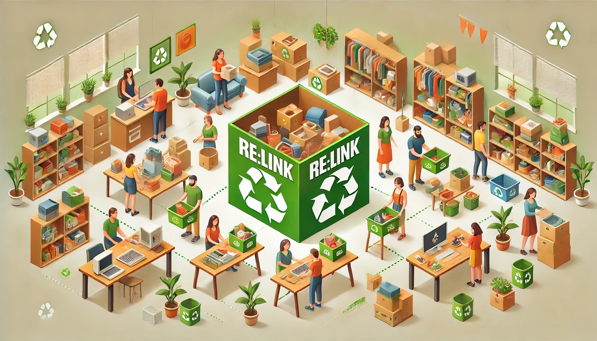
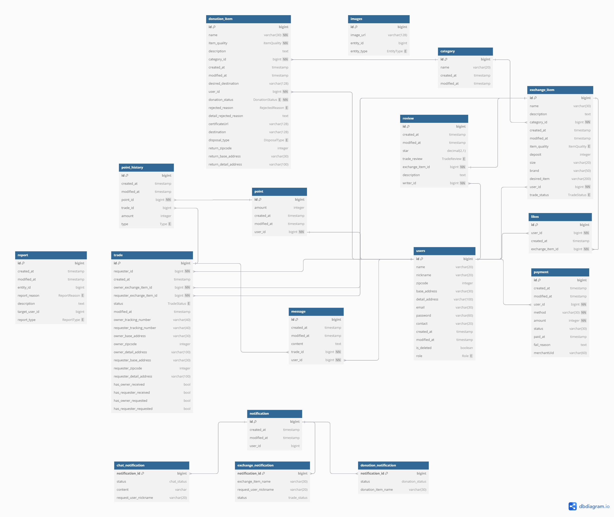
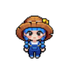
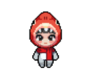

# ReLink

  

## 📑 목차

1. [서비스 소개](#서비스-소개)
2. [시스템 아키텍처](#시스템-아키텍처)
3. [API 명세서](#api-명세서)
4. [팀원 소개](#팀원-소개)
5. [그라운드 룰](#그라운드-룰)

  

## 🎵 서비스 소개

> 안녕하세요.
>
>
> 프로젝트 ReLINK입니다
>
> 저희는 크림(KREAM)과 같은 한정판 리셀 플랫폼에 `기부`와 `교환`이라는 새로운 가치를 더하고자 합니다
>
> 더 이상 사용하지 않는 중고 명품이나 한정판 제품에 새로운 생명을 불어넣어, 소유자에게는 의미 있는 활용 방안을, 새로운 주인에게는 다양한 제품을 경험할 수 있는 기회를 제공하고자 합니다
>
> 특히 기부 시스템을 통해 사용자들이 자연스럽게 사회공헌 활동에 참여할 수 있도록 장려하여,
>
> 단순한 중고거래 플랫폼을 넘어, 사회적 가치를 창출하는 혁신적인 서비스로 자리매김하고자 합니다
>
> ReLINK는 단순히 물건과 물건을 연결하는 것이 아닌, 사람과 사람, 그리고 사회적 가치를 연결하는 새로운 플랫폼이 되기를 희망합니다
>

  

## 🏗️ 시스템 아키텍처

  

## ⌗ ERD

  

## 📚 API 명세서

 

### 💬 채팅 API

| Method | Endpoint                   | Description   |
|:------:|:---------------------------|:--------------|
|  GET   | `/chat/{tradeId}`          | 문의하기 (채팅방 진입) |
|  GET   | `/chat`                    | 채팅방 커넥션 검증    |
|  GET   | `/chat/{tradeId}/messages` | 채팅방 이전 내역 보내기 |
|  POST  | `/chat/{tradeId}/message`  | 채팅 메시지 보내기    |
|  POST  | `/chat/{tradeId}/image`    | 채팅 이미지 저장하기   |

 

### 🚨 신고 API

| Method | Endpoint                           | Description         |
|:------:|:-----------------------------------|:--------------------|
|  GET   | `/trades/{tradeId}/report`         | 거래 신고하기 페이지 (조회)    |
|  GET   | `/items/exchanges/{itemId}/report` | 교환 상품 신고하기 페이지 (조회) |
|  POST  | `/trades/{tradeId}/report`         | 거래 신고하기             |
|  POST  | `/items/exchanges/{itemId}/report` | 교환 상품 신고하기          |
|  POST  | `/trades/{tradeId}/report/images`  | 신고하기: 사진 등록         |

 

### 💰 결제 API

| Method | Endpoint                      | Description        |
|:------:|:------------------------------|:-------------------|
|  GET   | `/users/point/history/charge` | 포인트 충전 내역 페이지 (조회) |
|  POST  | `/users/point`                | 포인트 충전하기           |
|  GET   | `/users/point/history/usage`  | 포인트 사용 내역 페이지 (조회) |

 

### 👨🏻‍💻 회원 API

| Method | Endpoint                       | Description            |
|:------:|:-------------------------------|:-----------------------|
|  POST  | `/auth/signup`                 | 회원가입                   |
|  GET   | `/users/check-email`           | 이메일 중복 검사              |
|  GET   | `/users/check-nickname`        | 닉네임 중복 검사              |
| DELETE | `/users`                       | 회원 탈퇴                  |
|  POST  | `/auth/login`                  | 로그인                    |
|  GET   | `/users`                       | 사용자 페이지                |
|  PUT   | `/users/info`                  | 사용자 정보 수정              |
|  GET   | `/users/reliability`           | 내 신뢰도 페이지              |
|  GET   | `/users/info`                  | 사용자 정보 조회 페이지          |
|  POST  | `/users/image`                 | 사용자 사진 등록              |
| DELETE | `/users/image/{imageId}`       | 사용자 사진 삭제              |
|  GET   | `/users/reviews`               | 사용자가 작성한 후기 내역 페이지(조회) |
|  GET   | `/users/items/exchanges/likes` | 내 관심 상품 목록 페이지 (조회)    |
|  GET   | `/users/reviews/{reviewId}`    | 사용자가 작성한 후기 단건 조회      |
|  GET   | `/users/address`               | 유저 기본 주소지 불러오기         |
|  GET   | `/users/point`                 | 사용자의 현재 포인트 조회하기       |
|  GET   | `/notifications`               | 알림 페이지 조회              |

 

### ♻️ 교환 상품 API

| Method | Endpoint                                     | Description              |
|:------:|:---------------------------------------------|:-------------------------|
|  GET   | `/items/exchanges`                           | 전체 사용자가 보는 교환 상품 목록      |
|  GET   | `/items/exchanges/{itemId}`                  | 교환하기 페이지 (조회)            |
|  GET   | `/items/exchanges/available`                 | 교환할 내 물품 선택 페이지 (조회)     |
|  GET   | `/users/items/exchanges`                     | 내 교환 상품 목록보기             |
|  GET   | `/users/items/exchanges/{itemId}`            | 내 교환 상품 수정하기 위해 진입하는 페이지 |
|  PUT   | `/users/items/exchanges/{itemId}`            | 내 교환 상품 수정               |
| DELETE | `/users/items/exchanges/{itemId}`            | 내 교환 상품 삭제하기             |
|  POST  | `/items/exchanges/{itemId}/images`           | 교환상품 사진 등록               |
| DELETE | `/items/exchanges/{itemId}/images/{imageId}` | 교환상품 사진 삭제               |
|  POST  | `/item/exchange`                             | 교환 상품 등록                 |
|  POST  | `/items/exchanges/{itemId}/available`        | 교환할 내 물품 선택              |
|  POST  | `/items/exchanges/{itemId}/like`             | 교환 상품 찜하기/해제하기           |

 

### 🎁 기부 상품 관리

| Method | Endpoint                                     | Description            |
|:------:|:---------------------------------------------|:-----------------------|
|  POST  | `/item/donation`                             | 기부 상품 등록               |
|  GET   | `/items/donations`                           | 전체 사용자가 보는 기부 완료 내역 화면 |
|  GET   | `/users/donations`                           | 내 기부 내역 보기             |
|  GET   | `/users/items/donations/{itemId}`            | 기부 상품 상세 페이지 (조회)      |
| DELETE | `/users/items/donations/{itemId}`            | 내 기부 상품 삭제하기           |
|  GET   | `/donations/{donationItemId}/rejection`      | 기부 알림 자세한 화면: 검수 부적합   |
| DELETE | `/items/donations/{itemId}/images/{imageId}` | 기부상품 사진 삭제             |
|  POST  | `/items/donations/{itemId}/images`           | 기부상품 사진 등록             |
|  POST  | `/donations/{donationItemId}/rejection`      | 기부 알림 검수 부적합: 반송 여부    |
|  GET   | `/donations/{donationItemId}/completion`     | 기부 알림 자세한 화면: 기부 완료    |

 

### 🤝 거래 관리 API

| Method | Endpoint                                | Description          |
|:------:|:----------------------------------------|:---------------------|
|  POST  | `/trades/{tradeId}/request`             | 교환 신청하기              |
|  POST  | `/trades/{tradeId}/request-cancel`      | 교환 신청 취소하기           |
|  POST  | `/trades/{tradeId}/completion/address`  | 교환 수락하기: 주소지 입력 받기   |
|  POST  | `/trades/{tradeId}/completion/recieved` | 교환 수락하기: 수령 완료 누르기   |
|  POST  | `/trades/{tradeId}/tracking-number`     | 교환 진행 페이지(운송장 번호 입력) |
|  GET   | `/trades/{tradeId}/completion`          | 교환 진행 상황 페이지(조회)     |
|  GET   | `/trades/{tradeId}/cancel`              | 교환 취소하기 페이지(조회)      |
|  POST  | `/trades/{tradeId}/cancel`              | 교환 취소하기              |
|  GET   | `/trades/{tradeId}/review`              | 거래 후기 작성 페이지 (조회)    |
|  POST  | `/trades/{tradeId}/review`              | 거래 후기 작성하기           |

 

## 🧑‍💻 팀원 소개

### Backend Engineers

|                            BE                            |                            BE                            |                           BE                            |                            BE                             |                            BE                            |
|:--------------------------------------------------------:|:--------------------------------------------------------:|:-------------------------------------------------------:|:---------------------------------------------------------:|:--------------------------------------------------------:|
|  |  |  |  |  |
|      [예원](https://github.com/yaewon0411)                 |                [건우](https://github.com/dbrjsdn2051)      |           [한비](https://github.com/TIP-Santa)            |            [의정](https://github.com/GoUiJeong)             |            [시연](https://github.com/siyeon02)             |

## 🏆 Ground Rules

### ⏰ Daily Schedule

|     Time      | Activity                                                 |
|:-------------:|:---------------------------------------------------------|
| 09:00 - 10:00 | 🧮 알고리즘 코드카타 진행                                          |
| 10:10 - 10:30 | 🌅 모닝 데일리 스크럼   - 오늘 할 일 공유   - 이전 날 공유되지 못한 이슈 안내 |
| 12:00 - 14:00 | 🍱 점심 식사 (슬랙으로 공유)                                       |
| 20:00 - 20:15 | 🌙 회고 스크럼   - 오늘 한 일 공유   - 이슈 공유                  |

### 📝 Task Management Rules

1. ✨ **시간 엄수**
    - 우리의 시간은 소중해요

2. 📝 **명확한 문서화**
    - 모든 내용은 문서로 이야기해요

3. 🤝 **소통 방식**
    - 자유롭게 소통해요
    - 편하게 질문해요

4. 🎯 **작업 관리**
    - 모든 내용은 문서로 남겨요
    - 의견은 근거를 들어 제시해요

5. ✨ **피드백 문화**
    - 서로의 코드를 존중해요

---
© 2025 Staccato. All rights reserved.